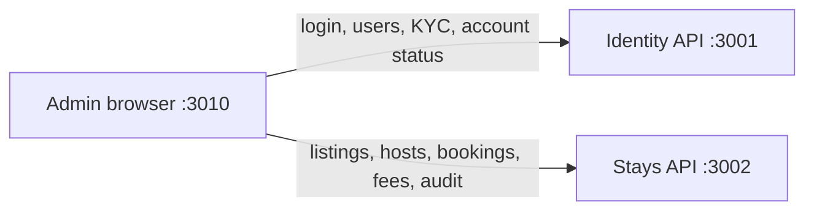
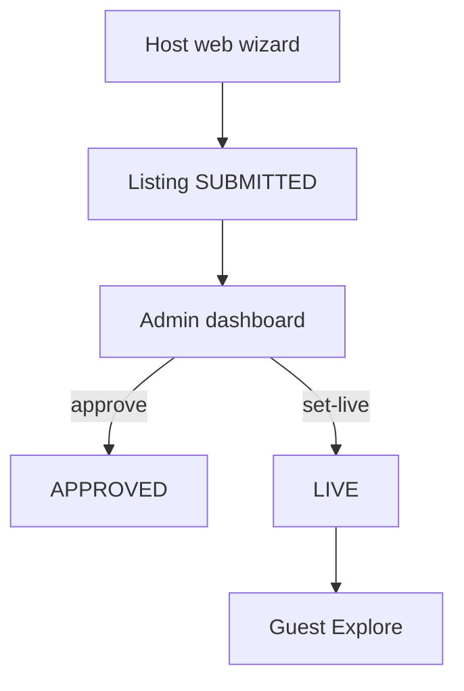

# Nexa Stays — Admin Dashboard

**Audience:** product / engineering / ops.  
**Code:** [`nexastays_dashboard/`](../nexastays_dashboard/)  
**Local URL:** [http://localhost:3010](http://localhost:3010)  
**Related:** [`LISTING_FLOW.md`](./LISTING_FLOW.md) · [`ARCHITECTURE.md`](./ARCHITECTURE.md) · [`BACKEND_AND_DATABASE.md`](./BACKEND_AND_DATABASE.md)

---

## 1. One-sentence summary

`nexastays_dashboard` is the **operations console** for Nexa Stays: admins log in via Identity, then moderate listings/hosts, inspect bookings and KYC, tune fees, and audit marketplace actions against the Stays and Identity APIs.

---

## 2. What it is (and isn’t)

| It is | It is not |
|-------|-----------|
| Internal admin UI for daily-rentals ops | Guest Explore / booking web (`nexastays_web`) |
| Client-side Next.js app calling live APIs | Server-rendered BFF with its own DB |
| Listing approve → set-live gate | Host listing wizard |
| Fee / commission settings | Payment provider console |

**Package:** `nexa-stays-admin-dashboard` (`0.1.0`)  
**Stack:** Next.js **14.2** (App Router), React 18, TypeScript, Tailwind 3, Lucide icons  
**Port:** `3010` (`npm run dev` / `npm start`)

---

## 3. Runtime dependencies



| Service | Env var | Default |
|---------|---------|---------|
| Stays | `NEXT_PUBLIC_STAYS_API_URL` | `http://127.0.0.1:3002/api/v1` |
| Identity | `NEXT_PUBLIC_IDENTITY_API_URL` | `http://127.0.0.1:3001/api/v1` |

Configured in `.env.local` (see `.env.local.example`). Defaults also live in `lib/api/config.ts`.

Both backends and their Postgres DBs must be running for a usable local session.

---

## 4. Auth

1. `/login` → `POST /auth/admin/login` on **Identity** with email/password.  
2. Access token stored in `localStorage` as `nexa_admin_access_token`.  
3. Every `apiFetch` sends `Authorization: Bearer <token>`.  
4. **401** clears the token and redirects to `/login`.  
5. Logout (topbar) clears token and returns to `/login`.

**Guards are client-only** (`AuthProvider`) — there is no Next.js `middleware.ts`. Unauthenticated users are redirected to `/login`; authenticated users hitting `/login` go to `/`.

Default login form hint email: `admin@nexastays.ma` (must exist as an admin in Identity).

---

## 5. App shell and navigation

**Layout:** sidebar (264px) + topbar + main content (`components/layout/app-chrome.tsx`).  
**Nav source:** `lib/nav.ts`.

| Label | Route | Purpose | Badge (when wired) |
|-------|-------|---------|-------------------|
| Overview | `/` | KPIs, pending listings, recent audit | — |
| Listings | `/listings` | Listing moderation | Pending listings |
| Users | `/users` | Guests/hosts, suspend, host approve | — |
| Host Applications | `/host-applications` | Host onboarding queue + ID docs | Pending host verification |
| Bookings | `/bookings` | Bookings + occupant documents | — |
| Reviews | `/reviews` | Listing reviews (mostly read-only) | — |
| Analytics | `/analytics` | GMV / funnel-style views | — |
| Moderation | `/moderation` | Risk queue (**stub**) | Open risks |
| KYC / Verification | `/kyc` | Identity KYC apps (`source=STAYS`) | Pending KYC |
| Support | `/support` | Tickets (**stub**) | Open tickets |
| Settings | `/settings` | Live fee % + local-only UI prefs | — |
| Roles & Permissions | `/roles` | RBAC matrix (**mock data**) | — |
| Audit Logs | `/audit-logs` | Stays admin audit trail | — |

Visual system: Playfair Display + DM Sans; brand rose `#E8507A` / accent `#F9A86C`.

---

## 6. Pages in detail

### 6.1 Overview `/`

- Loads `GET /admin/stays/stats` plus listings / audit samples.  
- Metric cards: hosts, live listings, bookings, GMV, platform revenue, avg nightly, etc.  
- Charts are mostly **derived** from totals (not full time-series APIs).  
- Surfaces pending listings and a short audit feed for ops awareness.

### 6.2 Listings `/listings`

Primary **listing moderation** surface. Aligns with [`LISTING_FLOW.md`](./LISTING_FLOW.md):

| Host / API status | Typical admin UI treatment | Public Explore? |
|-------------------|----------------------------|-----------------|
| `DRAFT` / `SUBMITTED` | Pending review | No |
| `APPROVED` | Approved — not public yet | No |
| `LIVE` | Active / public | **Yes** |
| `PAUSED` | Suspended / off market | No |
| `REJECTED` | Rejected (host sees Needs Changes) | No |

**Actions (live API):**

- **Approve** → `POST /admin/stays/listings/:id/approve`  
- **Reject** → `POST /admin/stays/listings/:id/reject` `{ reason }`  
- **Set live** → `POST /admin/stays/listings/:id/set-live`  

**Review drawer** (`ListingReviewDrawer`): title, location, pricing, media (blob fetch via admin media URLs), reject reason.

Important: **`APPROVED` alone does not publish.** Guests only see `LIVE`.

### 6.3 Users `/users`

- Merges Identity users (`GET /admin/users`) with Stays hosts (`GET /admin/stays/hosts`).  
- Suspend / reactivate → Identity `PATCH /admin/users/:id/status`.  
- Host profile approve/reject → Stays `/admin/stays/hosts/:id/approve|reject`.  
- Drawer: Identity audit snippets, KYC summary, related activity.

### 6.4 Host Applications `/host-applications`

Dedicated queue for **become-a-host** applications (web/mobile):

- List/filter by status.  
- Approve / reject application endpoints under `/admin/stays/host-applications/:id/…`.  
- Document preview: front / back / selfie via admin document blob routes.  
- Shows channel/source and whether identity was reused from existing KYC.

### 6.5 Bookings `/bookings`

- Lists bookings (`GET /admin/stays/bookings`).  
- Detail drawer: money breakdown, guests/occupants.  
- Occupant ID images via `/admin/stays/bookings/:id/occupants/:occupantId/id-document/:side`.  
- Cancel / override / dispute controls may appear in UI but are **not fully wired** to mutations yet.

### 6.6 Reviews `/reviews`

- Read list from `GET /admin/stays/reviews`.  
- Avg rating / distribution / simple sentiment heuristics.  
- Flag/remove actions are largely decorative today.

### 6.7 Analytics `/analytics`

- Reuses Stays stats + listings/bookings aggregates.  
- Revenue-style figures often estimated from GMV × commission.  
- Useful for ops snapshots; not a full warehouse BI tool.

### 6.8 Moderation `/moderation` & Support `/support`

- Explicit stubs: APIs return empty; banners note “not implemented”.  
- Reserved for future risk queues and support tickets.

### 6.9 KYC `/kyc`

- Identity `GET /admin/kyc/applications?source=STAYS`.  
- Filters pending / verified / rejected.  
- Primarily a **read-only** queue in the current UI (approve/reject KYC elsewhere or later).

### 6.10 Settings `/settings`

| Setting | Persisted? | API |
|---------|------------|-----|
| Guest fee % | Yes | `GET`/`PATCH /admin/stays/settings/fees` |
| Host fee % | Yes | same |
| Currency, booking rules, feature toggles | Local UI only | not persisted |

Fee body uses fractions (e.g. `0.05` = 5%).

### 6.11 Roles `/roles`

- Permission matrix cards from `lib/mock-data.ts`.  
- Not backed by a live RBAC API yet.

### 6.12 Audit Logs `/audit-logs`

- `GET /admin/stays/audit-logs`.  
- Search/filter in UI; export not wired.

---

## 7. API map (by backend)

### Identity (`:3001`)

| Action | Method | Path |
|--------|--------|------|
| Admin login | `POST` | `/auth/admin/login` |
| List users | `GET` | `/admin/users` |
| Update account status | `PATCH` | `/admin/users/:userId/status` |
| User KYC summary | `GET` | `/admin/users/:userId/kyc` |
| KYC applications | `GET` | `/admin/kyc/applications?source=STAYS…` |
| Identity audit | `GET` | `/admin/audit/logs?user_id=…` |

### Stays (`:3002`)

| Action | Method | Path |
|--------|--------|------|
| Stats | `GET` | `/admin/stays/stats` |
| List / detail listings | `GET` | `/admin/stays/listings` · `…/listings/:id` |
| Listing media (admin) | `GET` | `/admin/stays/listings/:id/media/:assetId` |
| Approve / reject / set-live | `POST` | `/admin/stays/listings/:id/approve` · `reject` · `set-live` |
| Bookings | `GET` | `/admin/stays/bookings` · `…/bookings/:id` |
| Occupant ID doc | `GET` | `/admin/stays/bookings/:bookingId/occupants/:occupantId/id-document/:side` |
| Hosts | `GET`/`POST` | `/admin/stays/hosts` · `…/hosts/:id/approve|reject` |
| Host applications | `GET`/`POST` | `/admin/stays/host-applications…` |
| Host docs | `GET` | `/admin/stays/host-applications/:id/documents/:kind` |
| Reviews | `GET` | `/admin/stays/reviews` |
| Audit | `GET` | `/admin/stays/audit-logs` |
| Fees | `GET`/`PATCH` | `/admin/stays/settings/fees` |

HTTP helper: `lib/api/client.ts` (`apiFetch`, `base: "stays" | "identity"`).

---

## 8. Key source layout

```
nexastays_dashboard/
├── app/
│   ├── (auth)/login/          # Admin login
│   └── (dashboard)/           # All authenticated pages
├── components/
│   ├── layout/                # Sidebar, topbar, chrome
│   ├── listings/              # ListingReviewDrawer
│   ├── charts/                # Lightweight SVG charts
│   ├── providers/             # AuthProvider
│   └── ui/                    # Buttons, cards, etc.
├── lib/
│   ├── api/                   # auth, stays-admin, identity-admin, users-admin, client, config
│   ├── hooks/                 # useAsyncList / useAsyncStats
│   ├── nav.ts
│   ├── types.ts
│   └── mock-data.ts           # Roles only (legacy)
└── .env.local.example
```

---

## 9. Local runbook

1. Start Identity DB + API (`:3001`).  
2. Start Stays DB + API (`:3002`).  
3. Copy `.env.local.example` → `.env.local` if needed.  
4. From `nexastays_dashboard/`:

```bash
npm install
npm run dev
```

5. Open [http://localhost:3010/login](http://localhost:3010/login) with an Identity **admin** account.

---

## 10. Known gaps / caveats

1. **README may still say “mock data”** — most screens are live API-backed; Roles is the main mock holdout.  
2. **No server middleware auth** — SPA token gate only.  
3. **Moderation / Support** stubs; some booking/review action buttons are decorative.  
4. **Settings** fee % is live; other toggles are local-only.  
5. **Charts** often synthesize series from aggregates.  
6. Listing publish path is two-step: **approve**, then **set live** (see listing flow doc).

---

## 11. How this fits the product



Admins also:

- Approve **host applications** before hosts can create listings.  
- Review **KYC** and suspend accounts when needed.  
- Inspect **bookings** / occupant documents for trust & safety.  
- Adjust **guest/host fee** percentages that feed booking pricing.
